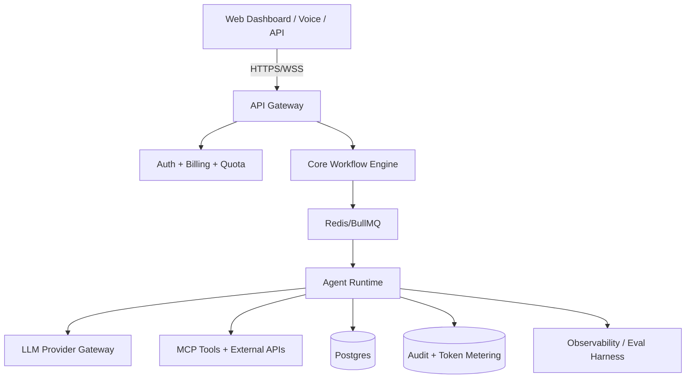

# System Architecture: AI code-review agent for small teams

`5-ai-code-review-agent`

---

## 1. Architectural Overview

Decoupled, modular pattern. Frontend + API gateway + queue + agent core + MCP tool layer + observability sidecar.

---

## 2. Component Specifications

### 2.1 Frontend / Interface
- Next.js (React) + Tailwind or vanilla CSS design tokens.
- Voice vertical: Twilio/Vapi/Retell PSTN handler.

### 2.2 API & Control Plane
- Node/TypeScript or Python FastAPI.
- OAuth 2.0 / JWT session, token-bucket rate limit per org.

### 2.3 Agent Runtime
- State machine; explicit transitions.
- Model gateway w/ fallback (Claude 3.5 Sonnet primary; Haiku/mini for triage).
- MCP server adapters for all tool integrations.

### 2.4 Data & Storage
- Postgres (Users, Orgs, Tasks, Executions, AuditLogs, Billing).
- Redis for queue + session locks.
- ClickHouse/Timescale if telemetry-heavy.

### 2.5 Observability & Eval
- OpenTelemetry traces per execution.
- LLM-as-judge eval harness running on every prod sample.
- Per-feature cost dashboard.

---

## 3. Data Flow

1. Client/webhook triggers API Gateway.
2. Auth + quota check; if over budget, return 402.
3. Job worker dequeues; agent runtime executes via MCP tools + LLM.
4. Each tool call: PII scrubbed, audit logged, circuit-breaker checked.
5. Output persisted; HITL gate if high-impact.
6. Eval harness samples N% of prod runs for drift detection.

---

## 4. Security & Privacy Architecture

- **Zero-knowledge logs:** secrets/PII scrubbed before persistence or LLM context.
- **Circuit breaker on token/rate budget** with hard kill switch.
- **HITL gate** before any irreversible action.
- **Stateless workers** in sandboxed processes.

---

## 5. Project-Specific Stack

GitHub App w/ webhook; Claude 3.5 Sonnet for review; ignore-list = repo YAML; Stripe per-seat.

---

## 6. Project-Specific Components

- **GitHub PR webhook**
- **diff-aware review (bug/security/style)**
- **suggested fixes inline**
- **ignore-list per repo**

---

## 7. Known Failure Modes (defensive design)

- False positives cause alert fatigue.
- latency too high for fast-moving PRs.
- comment conflicts with human reviewer.
