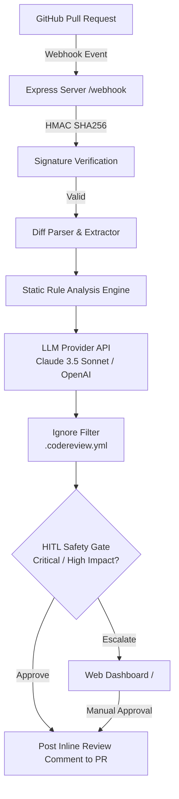

# 🤖 AI Code-Review Agent for Small Teams

[](https://nodejs.org/)
[](https://www.typescriptlang.org/)
[](LICENSE)
[](#testing--verification)

An intelligent, diff-aware **GitHub PR Code Review Agent** designed specifically for small engineering teams (3–15 developers). It acts as an automated first-pass reviewer to unblock senior developers, catch subtle design & security vulnerabilities before syntax linters, and eliminate alert fatigue through granular per-repository configuration and Human-in-the-Loop (HITL) safety controls.

---

## 🎯 Key Features

- ⚡ **GitHub PR Webhook Listener**: Real-time integration via GitHub App webhooks with HMAC-SHA256 signature verification.
- 🔍 **Diff-Aware Hybrid Analysis**:
  - **Deterministic Static Engine**: Instantly flags code injection (`eval`), XSS vulnerabilities (`innerHTML`), hardcoded secrets (`API keys/tokens`), loose equality (`==`), and empty `catch` blocks.
  - **LLM Deep Review Engine**: Supports **Anthropic Claude 3.5 Sonnet** and **OpenAI GPT-4o** to generate actionable, inline suggestions for complex logic issues without nitpicks.
- 🛡️ **Human-in-the-Loop (HITL) Safety Gate**: Automatically escalates high-impact or critical security findings to the dashboard before posting, ensuring human oversight where it matters most.
- 🎯 **Per-Repo Custom Ignore Config (`.codereview.yml`)**: Allows engineering teams to exclude specific file patterns, categories, or regex paths from review scanning.
- 📊 **Interactive Web Dashboard**: Built-in visual dashboard (`/`) for monitoring PR queues, inspecting findings, and approving/rejecting escalated reviews with one click.
- 🧪 **Golden Case Evaluation Suite**: Built-in eval framework (`runEval`) to benchmark review accuracy, track pass rates, and keep false positives under 5%.
- 💳 **Stripe Billing Integration**: Pre-built webhooks and billing infrastructure supporting per-seat subscription models.

---

## 🏗️ System Architecture



---

## 📂 Project Structure

```
5-ai-code-review-agent/
├── src/
│   ├── index.ts                # Express application entrypoint & route registration
│   ├── billing/
│   │   └── index.ts            # Stripe customer management & webhook events handler
│   ├── config/
│   │   └── index.ts            # Environment variable validation & config loader
│   ├── dashboard/
│   │   └── index.ts            # Web dashboard HTML renderer & interactive UI logic
│   ├── eval/
│   │   └── index.ts            # Golden case evaluation suite & pass-rate benchmark
│   ├── hitl/
│   │   └── gate.ts             # Human-In-The-Loop decision matrix & gate evaluator
│   ├── ignore/
│   │   └── loader.ts           # .codereview.yml parser & finding matcher
│   ├── review/
│   │   ├── claude.ts           # LLM review orchestration (Anthropic & OpenAI)
│   │   └── engine.ts           # Static analysis engine & diff classifier
│   ├── types/
│   │   └── index.ts            # TypeScript interfaces & domain types
│   ├── utils/
│   │   ├── diffParser.ts       # Unified diff patch parsing helper
│   │   └── signature.ts      # GitHub webhook signature validation
│   └── webhook/
│       ├── handler.ts          # Main GitHub webhook controller
│       └── postComment.ts      # Octokit API wrapper for posting PR review comments
├── tests/
│   └── review.test.ts          # Comprehensive test suite (diff, engine, ignore, HITL, config)
├── .env.example                # Template for required environment variables
├── ARCHITECTURE.md             # In-depth architectural design specification
├── PRD.md                      # Product Requirements Document
├── package.json                # Project dependencies & scripts
└── tsconfig.json               # TypeScript compiler configuration
```

---

## 🚀 Quick Start Guide

### Prerequisites

- **Node.js**: `v20.0.0` or higher
- **npm**: `v9.0.0` or higher
- **LLM API Key**: Anthropic Claude (`sk-ant-...`) or OpenAI (`sk-...`)

### Installation

1. **Clone the repository**:
   ```bash
   git clone https://github.com/your-org/5-ai-code-review-agent.git
   cd 5-ai-code-review-agent
   ```

2. **Install dependencies**:
   ```bash
   npm install
   ```

3. **Configure Environment Variables**:
   Copy the example environment file and update your configuration:
   ```bash
   cp .env.example .env
   ```

4. **Start the Development Server**:
   ```bash
   npm run dev
   ```
   The server will start listening at `http://localhost:3000`.

---

## ⚙️ Environment Configuration

| Variable | Required | Default | Description |
| :--- | :---: | :---: | :--- |
| `GITHUB_APP_ID` | Yes | - | GitHub App ID |
| `GITHUB_WEBHOOK_SECRET` | Yes | - | Webhook secret configured in your GitHub App settings |
| `GITHUB_PRIVATE_KEY_PATH` | Yes | - | Path to GitHub App private key (`.pem`) file |
| `LLM_API_KEY` | Yes | - | API key for LLM Provider (Anthropic / OpenAI) |
| `LLM_PROVIDER` | No | `anthropic` | LLM provider (`anthropic` or `openai`) |
| `LLM_MODEL` | No | `claude-3-5-sonnet-20241022` | Model identifier to use for code reviews |
| `STRIPE_SECRET_KEY` | Yes | - | Stripe API Secret Key |
| `STRIPE_WEBHOOK_SECRET` | Yes | - | Stripe Webhook signing secret |
| `DATABASE_URL` | Yes | - | PostgreSQL connection string |
| `REDIS_URL` | Yes | - | Redis connection string for queuing |
| `PORT` | No | `3000` | HTTP server port |
| `FRONTEND_URL` | No | `http://localhost:3000` | Frontend / Dashboard base URL |
| `HITL_CONFIDENCE_THRESHOLD` | No | `0.85` | Confidence threshold triggering HITL review |

---

## 🛠️ Per-Repository Ignore Configuration

Create a `.codereview.yml` file in the root of target repositories to exclude paths or rules from AI review:

```yaml
ignore:
  - paths:
      - "dist/"
      - "node_modules/"
      - "vendor/"
    categories:
      - style
  - pattern: ".*\\.test\\.ts$"
    categories:
      - style
      - bug
```

---

## 🧪 Testing & Verification

Run the automated test suite using Node's native test runner via `tsx`:

```bash
npm test
```

### Additional Commands

- **Type Check**:
  ```bash
  npm run typecheck
  ```
- **Linting**:
  ```bash
  npm run lint
  ```
- **Build Production Bundle**:
  ```bash
  npm run build
  ```
- **Start Production Server**:
  ```bash
  npm start
  ```

---

## 📄 License

This project is licensed under the [MIT License](LICENSE).

